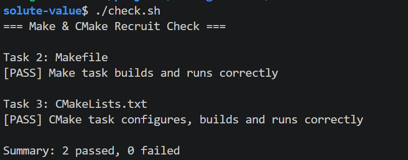

# Task 4：思考题

## 1. Make 和简单的 build.sh 有什么区别？

- 如果是个 Shell 脚本，不管到底修改了一个文件，还是一堆文件，都会连带着没修改的文件一起编译了，非常消耗时间消耗
- Make 则显然更智能👍，通过比较时间戳单独编译修改过的文件。

## 2. CMake 是编译器吗？
不是。依据朴素的理解，应当是一种生成 Makefile 类文件的工具，并不是编译器，打个比方如果说 Makefile 是蓝图， 那么 CMake 就应该是制图者。

执行 `cmake --build build` 时，最终仍然是`gcc`在编译 C 源文件，只不过这个过程被`cmake --build build`总包了，变成其中一个小分步。

## 3. 为什么不希望每次都重新编译所有 `.c` 文件？
全量编译会重复处理没有变化的源文件，浪费开发等待时间以及 CPU、内存和磁盘 I/O。正确声明依赖后，增量构建只处理变化文件及其受影响的目标，项目越大收益越明显。

## 4. check.sh [PASS] 结果

